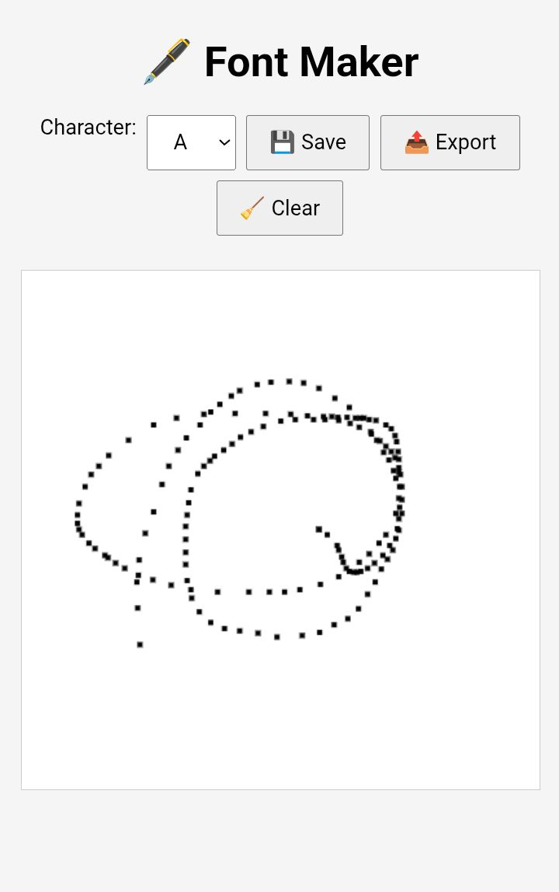

# ✏️ Font Maker

A browser-based tool to draw characters and export them as a custom `.ttf` font using [opentype.js](https://github.com/opentypejs/opentype.js).

---

## 📸 Screenshot

---

## ✨ Features

- ✍️ Draw glyphs for **A–Z** and **a–z**
- 💾 Save individual glyphs
- 📤 Export entire font to `.ttf`
- 📱 Mobile and desktop touch/mouse support
- 🧠 Built with HTML5 Canvas + opentype.js

---

## 🚀 How to Use

1. Open `index.html` in your browser (no server needed)
2. Select a character from the dropdown
3. Draw the character in the canvas area
4. Click **Save** to store the glyph
5. Click **Export** to download your custom `.ttf` font

---

## 📁 Folder Structure
font-maker/ 
├── index.html 
├── assets/ 
└── IMG_20250606_200423.jpg 
│
└── README.md
---

## 📌 Tips

- Use a stylus or mouse for cleaner glyphs
- Keep proportions similar across characters for better font consistency
- Export often so you don’t lose progress
